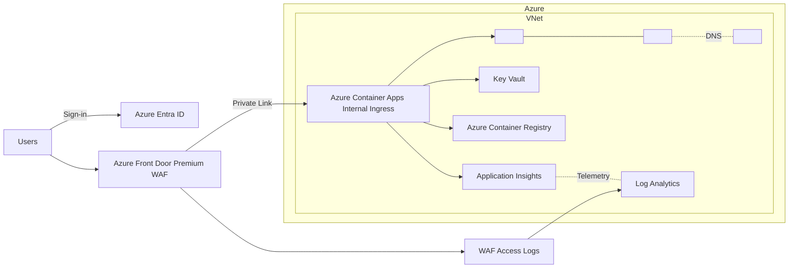
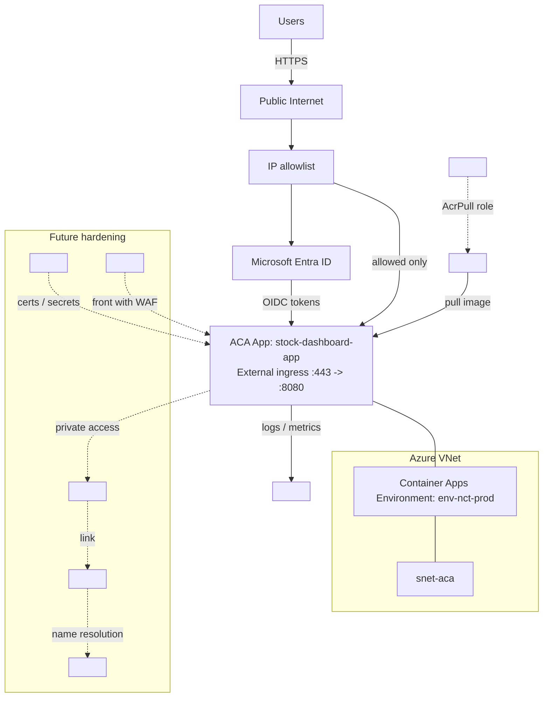
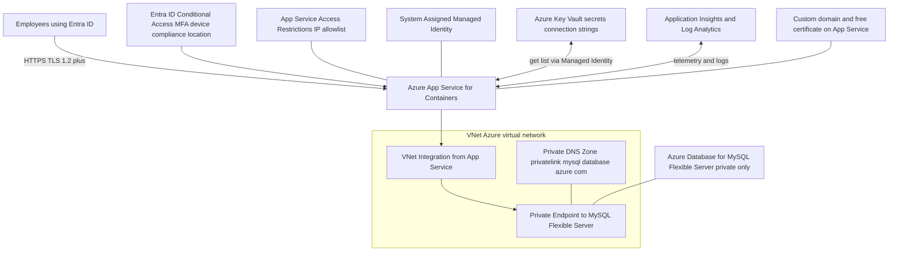

---


---




---
```mermaid
flowchart TD
  %% Entry and identity
  U[Employees using Entra ID] -->|HTTPS TLS 1.2 plus| AS[Azure App Service for Containers]
  CA[Entra ID Conditional Access MFA device compliance location] --> AS

  %% App layer hardening
  AR[App Service Access Restrictions IP allowlist] --- AS
  MI[System Assigned Managed Identity] --- AS

  %% Secrets
  KV[Azure Key Vault secrets connection strings] <-->|get list via Managed Identity| AS

  %% Monitoring
  AI[Application Insights and Log Analytics] <-->|telemetry and logs| AS

  %% Network and data
  subgraph VNet Azure virtual network
    VI[VNet Integration from App Service]
    PEP[Private Endpoint to MySQL Flexible Server]
    PDNS[Private DNS Zone privatelink mysql database azure com]
  end
  AS --> VI
  VI --> PEP
  PDNS --- PEP

  DB[Azure Database for MySQL Flexible Server private only] --- PEP

  %% Domain and cert
  DNS[Custom domain and free certificate on App Service] --- AS
